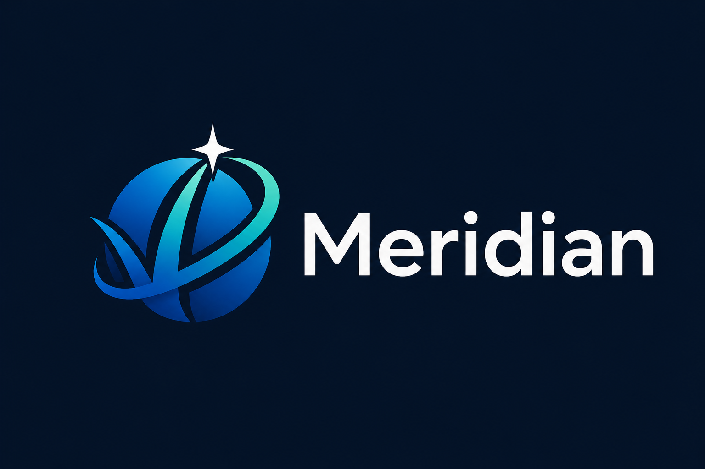

# Meridian

Meridian is an open-source volunteer operations platform for events.

It is designed for organizations that recruit, approve, coordinate, schedule, credential, track, and report on volunteer work across events and departments. Meridian models volunteer operations, not employment, payroll, HR, or personnel management.

Meridian is currently in early project scaffolding. The repository contains requirements, technical direction, and development-process guardrails. Product behavior has not been implemented yet.

## What Meridian Is For

Meridian is intended to support:

- organizations, events, departments, teams, and volunteer membership;
- volunteer status, training, waivers, shift eligibility, and credentials;
- planned shifts and actual hours worked;
- field reports, incidents, audit history, and operational records;
- offline-capable field workflows for event environments with limited connectivity;
- central and on-site node operation for Alpha 1.

## Source Documents

The current source-of-truth documents are:

- [Requirements document](docs/meridian-requirements-document.md)
- [Technical specification](docs/meridian-technical-spec.md)
- [Technology baseline](docs/meridian-technology-baseline.md)
- [Development process](docs/process/meridian-development-process.md)

Start with the development process before opening issues or pull requests. It defines how work should move from requirement to implementation, review, automated checks, and human QA.
Before adding, replacing, or upgrading runtimes, packages, libraries, services, wrappers, test tools, or package managers, read the technology baseline and ask for human approval if the change is not already approved there.

## Development Process

Meridian uses a traceable development workflow:

- every meaningful change references a requirement ID or technical spec section;
- pull requests must include traceability, acceptance criteria, tests, and human QA;
- QA scenarios live under [docs/qa](docs/qa);
- the traceability matrix lives at [docs/process/traceability-matrix.md](docs/process/traceability-matrix.md);
- commit messages and PR titles use [Conventional Commits](docs/process/conventional-commits.md).

## Repository Layout

Meridian uses a monorepo layout aligned with the Alpha 1 technical specification:

```text
apps/
  server/        Laravel, Orchid, and API application
  mobile/        Vue and Capacitor field application
  desktop/       Electron on-site workstation wrapper
packages/
  shared-types/  Shared TypeScript types
  openapi-client/ Generated TypeScript API client
deploy/
  docker/        Docker and Docker Compose configuration
  caddy/         Reverse proxy and certificate configuration
  powersync/     PowerSync service configuration
  dns/           DNS configuration for on-site deployments
```

These directories are placeholders until their later Alpha 1 tasks add application or deployment behavior.

## Local Validation

Run the process checks before opening a pull request:

```bash
corepack pnpm run check
```

Individual checks are also available:

```bash
corepack pnpm run process:traceability
corepack pnpm run process:qa
corepack pnpm run process:repo
corepack pnpm run process:pr-template
corepack pnpm run commit:check -- --message "docs(process): update README"
```

The validators use the Python standard library. Composer and Node project checks are designed to become active as those project files are added. JavaScript checks use the Corepack-managed pnpm version declared in `package.json`.

## License

Meridian is licensed under the [GNU Affero General Public License v3.0 or later](LICENSE).
